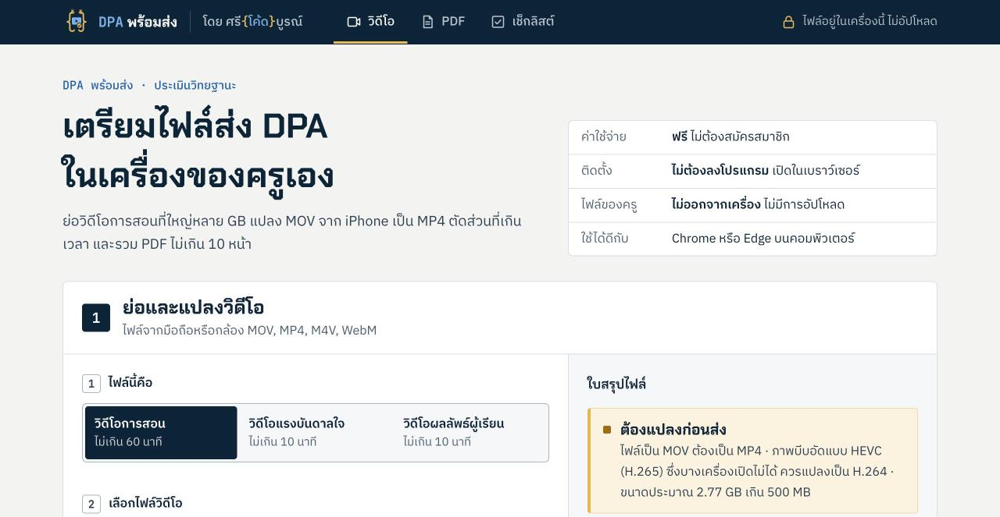
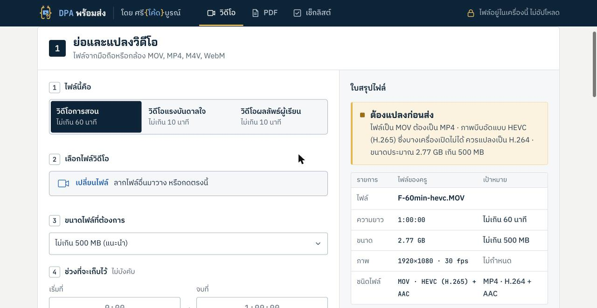
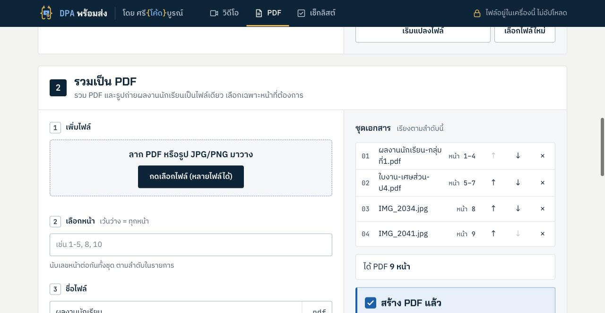

<p align="center">
  
</p>

<h1 align="center">DPA พร้อมส่ง</h1>

<p align="center">
  ย่อไฟล์วิดีโอการสอน แปลง MOV เป็น MP4 ตัดคลิปให้ไม่เกินเวลา และรวม PDF<br>
  สำหรับครูที่ยื่นประเมินวิทยฐานะผ่านระบบ DPA · <b>ฟรี</b> · ไม่ต้องลงโปรแกรม · <b>ไฟล์ไม่ออกจากเครื่อง</b>
</p>

<p align="center">
  <a href="https://sricodeboon.infinityfreeapp.com/dpa/"><b>เปิดใช้งาน</b></a> ·
  <a href="#เลี้ยงโอวัลตินครูแจ็กสักแก้ว">สนับสนุนผู้พัฒนา</a> ·
  <a href="https://www.facebook.com/sricodeboon">เพจศรีโค้ดบูรณ์</a>
</p>



## ทำไมถึงมีเครื่องมือนี้

ในกลุ่มครูที่เตรียมยื่นประเมินวิทยฐานะ มีคำถามเดิมวนซ้ำทุกสัปดาห์:

- ไฟล์วิดีโอการสอน 5–6 GB ต้องย่อยังไง
- ถ่ายจาก iPhone ได้ไฟล์ MOV ต้องแปลงเป็น MP4 ก่อนไหม
- คลิปเกิน 60 นาทีไป 2–3 นาทีจะเป็นอะไรไหม

ทางแก้ที่ใช้กันอยู่คือโปรแกรมภาษาอังกฤษที่ต้องติดตั้ง หรืออัปคลิปขึ้น YouTube แล้วดาวน์โหลดกลับ เครื่องมือนี้ทำทุกอย่างให้จบในหน้าเว็บเดียวเป็นภาษาไทย

## ทำอะไรได้

| ส่วน | รายละเอียด |
|---|---|
| **วิดีโอ** | เลือกประเภทคลิป (การสอน ≤ 60 นาที · แรงบันดาลใจ ≤ 10 นาที · ผลลัพธ์ผู้เรียน ≤ 10 นาที) แล้วระบบตรวจให้ทันทีว่า **พร้อมส่ง / ต้องแปลง / ต้องแก้** |
| | ย่อให้ไม่เกิน 300 MB / 500 MB / 800 MB / 1 GB ตามที่เลือก |
| | แปลง MOV และ HEVC (H.265) จาก iPhone เป็น MP4 (H.264 + AAC) ที่เปิดได้ทุกเครื่อง |
| | ตัดช่วงต้น/ท้าย หรือกดปุ่ม "ตัดท้ายให้เหลือ 60 นาทีพอดี" |
| | ถ้าไฟล์เล็กพออยู่แล้วแต่เป็น MOV จะแปลงแบบเร็ว ไม่ลดคุณภาพ ใช้เวลาไม่กี่วินาที |
| | หลังแปลงเสร็จ เปิดไฟล์ผลลัพธ์ตรวจซ้ำ ทั้งความยาว ขนาด และชนิดไฟล์ |
| **PDF** | รวม PDF หลายไฟล์และรูปถ่ายผลงานนักเรียน (JPG/PNG) เป็นไฟล์เดียว |
| | เลือกหน้าแบบ `1-5, 8, 10` เตือนเมื่อเกิน 10 หน้า รูปถ่ายถูกย่อและจัดลงหน้า A4 ตามแนวภาพ |
| **เช็กลิสต์** | รายการไฟล์ที่ต้องเตรียมก่อนกดส่ง ติ๊กแล้วจำไว้ในเครื่อง |





## ความเป็นส่วนตัว

ทุกขั้นตอนทำในเบราว์เซอร์ของเครื่องครูเอง ด้วย WebCodecs และ JavaScript ไม่มีการอัปโหลดวิดีโอ เอกสาร หรือข้อมูลนักเรียนขึ้นเซิร์ฟเวอร์ ไม่มีระบบสมาชิก และไม่มีตัวติดตาม เซิร์ฟเวอร์ทำหน้าที่แค่ส่งหน้าเว็บมาให้เท่านั้น

## ใช้กับเบราว์เซอร์ไหน

- **แนะนำ Google Chrome หรือ Microsoft Edge บนคอมพิวเตอร์** เพราะเขียนไฟล์ลงดิสก์ได้โดยตรง ไฟล์ใหญ่แค่ไหนก็ไม่กินหน่วยความจำ
- เบราว์เซอร์อื่นที่รองรับ WebCodecs ก็ใช้ได้ แต่จะเก็บผลไว้ในหน่วยความจำก่อนดาวน์โหลด
- มือถือใช้ได้ แต่คลิปยาว 60 นาทีอาจช้ามากหรือหน่วยความจำไม่พอ

## ผลทดสอบ

ทดสอบบน MacBook กับ Chrome เมื่อ 27 ก.ย. 2569

| ไฟล์ต้นฉบับ | ผลลัพธ์ | เวลา |
|---|---|---|
| MOV HEVC 1080p 30fps ยาว 60 นาที ขนาด 2.77 GB · เป้า 500 MB | MP4 H.264 960×540 ขนาด **467 MB** ยาวครบ 1:00:00 | 5 นาที 18 วินาที |
| MOV HEVC 1080p 60fps ยาว 1 นาที (แบบไฟล์ iPhone) | MP4 H.264 720p 30fps ขนาด 20 MB | 5 วินาที |
| MP4 ยาว 11 นาที ตั้งเป็นวิดีโอแรงบันดาลใจ | ตัดเหลือ 10:00 พอดี ไม่เข้ารหัสใหม่ | ไม่ถึง 1 วินาที |
| MOV H.264 แนวตั้ง ขนาดไม่เกินเป้า | เปลี่ยนเป็น MP4 ภาพเดิม | ไม่ถึง 1 วินาที |

## รายละเอียดทางเทคนิค

- **ตัวแปลงวิดีโอ:** [Mediabunny](https://mediabunny.dev) 1.60 บน WebCodecs ใช้ชิปเข้ารหัสของเครื่อง จึงเร็วกว่า ffmpeg.wasm มาก
- **สูตร bitrate:** `(เป้า MB × 8 × 0.93 ÷ วินาที) − 128 kbps` ส่วนเผื่อ 7% กันไฟล์จริงเกินเป้า
- **ความละเอียด:** เลือกตาม bitrate ที่ได้ ตั้งแต่ 1.1 Mbps ขึ้นไปเป็น 720p, ตั้งแต่ 650 kbps เป็น 540p, ต่ำกว่านั้นเป็น 480p · คลิปที่เกิน 30 fps ลดเหลือ 30 fps
- **จำกัดสูงสุด 720p:** ทดสอบแล้วตัวเข้ารหัสฮาร์ดแวร์ที่ 1080p ใช้ bitrate เกินที่ตั้งเกือบ 2 เท่า ขณะที่ 720p และ 540p ตรงเป้า ±5%
- **รวม PDF:** [pdf-lib](https://pdf-lib.js.org)
- **หน้าตา:** แนว "โต๊ะช่าง" ฝั่งซ้ายเป็นขั้นตอน ฝั่งขวาเป็นใบสรุปไฟล์ ไม่มีเฟรมเวิร์ก ไม่มีขั้นตอน build · ไลบรารีวางไว้ใน `vendor/` ไม่โหลดจาก CDN

### โครงไฟล์

```
index.php        หน้าเว็บ (ฝังฟอนต์และ CSS ในหน้า)
style.css        สไตล์ (สว่าง/มืดตามเครื่อง)
app.js           ตรรกะทั้งหมด: อ่านไฟล์ วางแผน แปลงวิดีโอ รวม PDF เช็กลิสต์
ui.js            ส่วนแสดงผล: คอลัมน์เป้าหมาย แท็บ แถบความคืบหน้าเช็กลิสต์
brand/           โลโก้ favicon ไอคอน QR พร้อมเพย์
vendor/          mediabunny.min.mjs, pdf-lib.esm.min.js และใบอนุญาต
og.png           ภาพตอนแชร์ลิงก์
```

โฟลเดอร์นี้เป็นส่วนหนึ่งของเว็บ ศรีโค้ดบูรณ์ ซึ่งวางไว้ที่ `/dpa/` และใช้ฟอนต์ร่วมกับเว็บหลักจาก `/assets/fonts/` ถ้าจะรันในเครื่อง ให้วางโฟลเดอร์นี้ไว้ใต้ `htdocs/dpa/` ของเว็บหลัก แล้วรัน `php -S 127.0.0.1:8080 -t htdocs`

## เลี้ยงโอวัลตินครูแจ็กสักแก้ว

DPA พร้อมส่ง ทำโดยครูคนหนึ่งในเวลาหลังเลิกสอน และจะใช้ฟรีทุกฟีเจอร์ต่อไป ถ้าช่วยให้ครูส่งงานได้ทันและไม่ต้องนั่งแปลงไฟล์ทั้งคืน เลี้ยงโอวัลตินสักแก้วเป็นกำลังใจได้ครับ

เงินสนับสนุนใช้เป็นค่าโดเมน ค่าโฮสต์ และเวลาพัฒนาเครื่องมือตัวต่อไปสำหรับครู เช่น ปพ.5 ที่ส่งคะแนนเข้า SchoolMIS/SGS ได้

<p>
  
</p>

**พร้อมเพย์ 093-073-2896** · รัชเดช ศรีแก้ว · ยอดเท่าไรก็ได้ตามสะดวก

## ติดต่อ

- เพจ Facebook: [ศรีโค้ดบูรณ์](https://www.facebook.com/sricodeboon) ทักมาบอกได้ว่าอยากได้ฟีเจอร์ไหน หรือเจอไฟล์ที่แปลงไม่ได้
- อีเมล: sricodeboon@gmail.com

เครื่องมือนี้ทำขึ้นเองโดยอิสระ **ไม่ใช่ของ ก.ค.ศ.** เกณฑ์ความยาวและขนาดไฟล์อ้างอิงจากคู่มือและประสบการณ์ของครูที่ยื่นแล้ว ควรตรวจกับประกาศฉบับล่าสุดอีกครั้งก่อนยื่น

## ใบอนุญาต

สงวนลิขสิทธิ์ © 2569 ศรีโค้ดบูรณ์ เผยแพร่โค้ดเพื่อให้ดูและศึกษาได้ ดูรายละเอียดใน [LICENSE](LICENSE) · ไลบรารีใน `vendor/` เป็นไปตามใบอนุญาตของแต่ละตัว ได้แก่ Mediabunny (MPL-2.0) และ pdf-lib (MIT)
